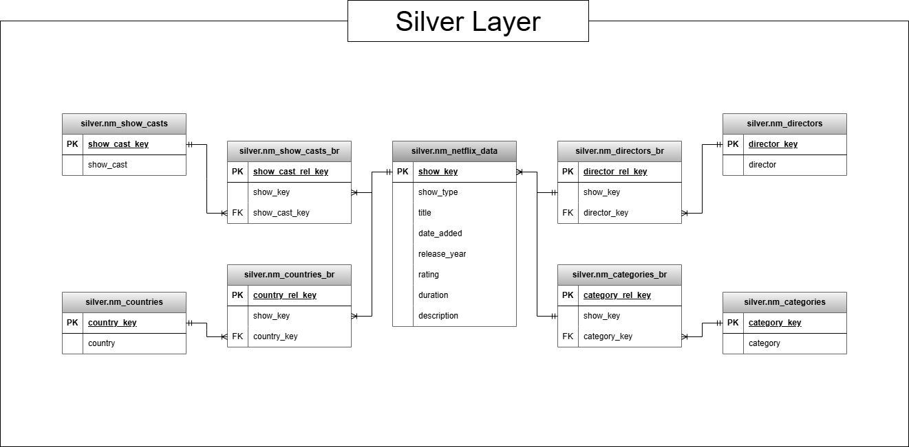
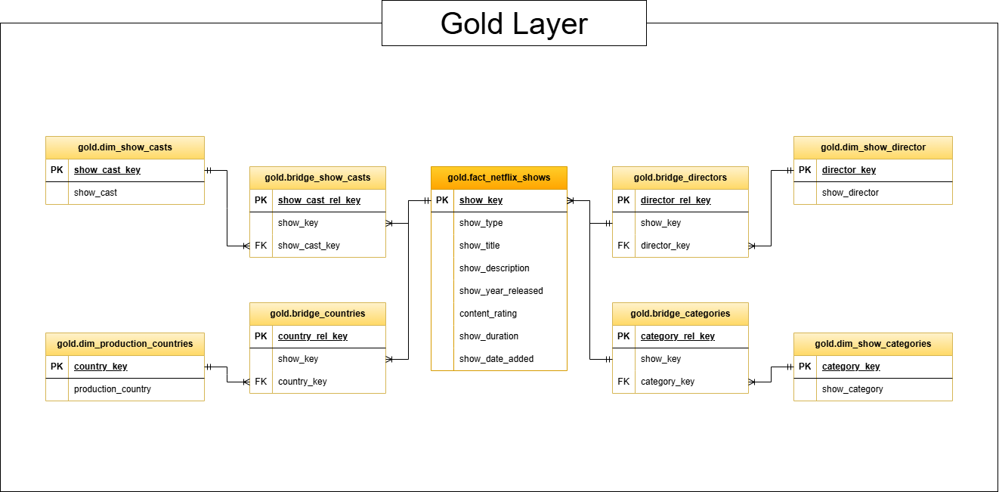

# Netflix Data Warehouse  

## Project Overview

This project implements a batch-processing Data Warehouse for Netflix titles data using a Medallion Architecture:

Raw Source (csv) → Bronze → Silver → Gold

The purpose of this repository is to demonstrate:

- Structured warehouse architecture design
- Data normalization techniques
- Many-to-many modeling with bridge tables
- Fact and dimension modeling
- Batch ETL processing
- Layer separation and governance foundations

**Version:** Proof of Concept (POC)
A future MVP version will introduce production-grade enhancements such as metadata logging, incremental loads, and audit enforcement.

**Author:** Gabriel Lyane Arevalo - Data Analyst

--- 

## Architecture Overview

### Medallion Architecture

#### Bronze Layer: Raw Ingestion

- Stores raw source data
- Minimal transformation
- Full reload strategy (TRUNCATE + COPY)
- Acts as recovery and audit layer
- Maintains 1:1 schema with source file

---

#### Silver Layer: Cleaned & Normalized

- Applies data cleansing
- Standardizes null handling
- Normalizes multi-valued fields
- Generates surrogate keys
- Implements many-to-many bridge tables

---

### Gold Layer — Analytics Model

- Exposes business-friendly fact and dimension views
- Designed for BI tools
- Simplifies reporting queries
- Isolated from transformation logic

---

## Repository Structure

```text
/netflix-data-warehouse
├── docs
│   └── netflix_data_dashboard.pbix
├── input_data
│   └── netflix_titles.csv
├── scripts
│   ├── bronze
│   │   ├── bronze_ddl.sql
│   │   └── bronze_load.sql
│   ├── silver
│   │   ├── silver_ddl.sql
│   │   ├── silver_load.sql
│   │   ├── silver_checks.sql
│   │   └── silver_normalized
│   │       ├── silver_nm_ddl.sql
│   │       ├── silver_nm_load.sql
│   │       ├── silver_nm_br_ddl.sql
│   │       └── silver_nm_br_load.sql
│   ├── gold
│   │   └── gold_load.sql
│   └── initialize_database.sql
├── .gitignore
├── LICENSE
└── README.md
```

---

## Bronze Layer

### Table: bronze.netflix_data

**Purpose**

- Preserve raw Netflix dataset
- Maintain source integrity
- Enable reprocessing if needed

**Characteristics**

- No constraints
- No transformations
- Designed for batch full reload
- Serves as ingestion layer only

---

## Silver Layer

The Silver layer performs data cleansing, normalization, and relational modeling.

### Key Transformations

- Trim whitespace
- Standardize null handling (COALESCE patterns)
- Replace empty values with business defaults
- Normalize comma-separated fields into relational tables
- Generate surrogate keys for all entities

---

### Normalized Tables

#### Core Table

- silver.nm_netflix_data

#### Dimension Tables

- silver.nm_show_casts
- silver.nm_countries
- silver.nm_directors
- silver.nm_categories

#### Bridge Tables (Many-to-Many)

- silver.nm_show_casts_br
- silver.nm_countries_br
- silver.nm_directors_br
- silver.nm_categories_br

---

### Modeling Strategy

- Surrogate key generation using deterministic formatting
- Many-to-many relationships handled via bridge tables
- Structured naming conventions
- Separation of entity tables and relationship tables
- Normalization of multi-valued attributes

---

## Gold Layer

The Gold layer exposes analytical views for reporting and BI consumption.

### Fact View: 

- gold.fact_netflix_shows

---

### Dimension Views

- gold.dim_show_casts
- gold.dim_production_countries
- gold.dim_show_director
- gold.dim_show_categories

---

### Bridge Views

- gold.bridge_show_casts
- gold.bridge_countries
- gold.bridge_directors
- gold.bridge_categories

---

## Data Models

### Silver Layer Data Model (3NF)



### Gold Layer (Star Schema)



---

## Processing Strategy

Current Strategy (POC):

- Full batch reload
- TRUNCATE + INSERT pattern
- Deterministic surrogate keys
- Sequential script execution

---

## Future Road Map

### Metadata & Governance

- ETL batch logging table
- Load timestamps
- Source file tracking
- Data lineage documentation

### Data Quality Controls

- NOT NULL enforcement
- Referential integrity constraints
- Duplicate detection
- Row count validation

### Performance Optimization

- Indexing strategy
- Partitioning if scaled
- Materialized views in Gold
- Incremental MERGE logic

### Production Hardening

- Transaction control
- Idempotent re-runs
- Failure logging
- Orchestration readiness (Airflow / Cron)

---

## Tech Stack

- PostgreSQL
- SQL (DDL + DML)
- Git (Version Control)
- Batch file ingestion

---